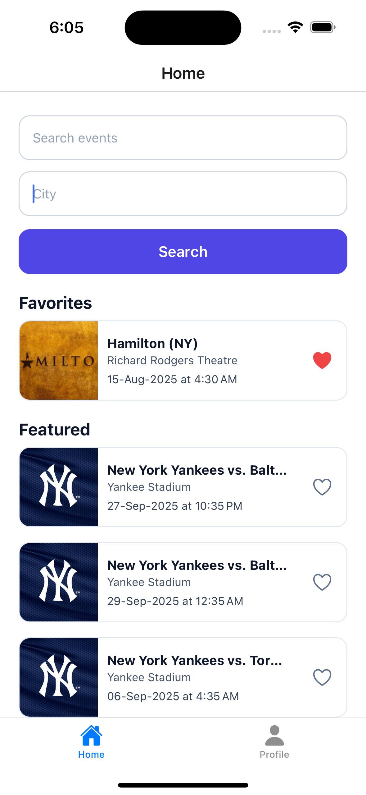
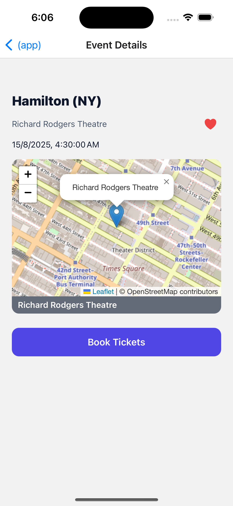
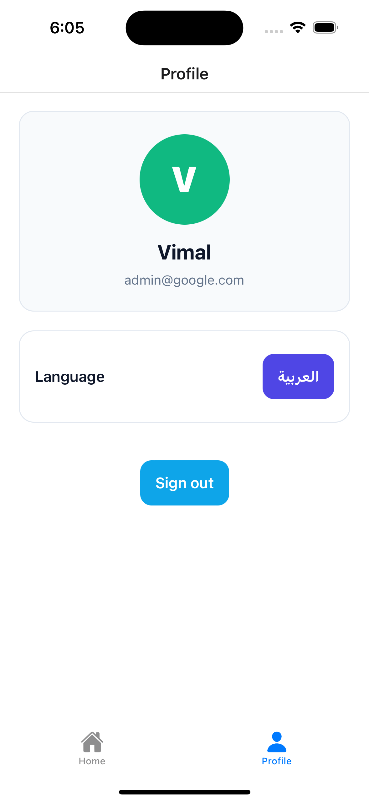

# Event Explorer

An Expo Router app for discovering events, with email/password auth, biometric/PIN app lock, favorites, localization (English/Arabic + RTL), and a map preview for event locations.

## Quick start

Prerequisites:

- Node.js LTS and npm
- For iOS: Xcode + Simulator (macOS only)
- For Android: Android Studio + emulator

1) Install dependencies

```bash
npm install
```

2) Configure API keys (Ticketmaster) and Firebase

- Open `app.json` and update `expo.extra`:
   - `EXPO_PUBLIC_TICKETMASTER_API_KEY`: your Ticketmaster Discovery API key
   - `firebase`: your Firebase web app config (Auth + Firestore)

Note: Keys in `expo.extra` are bundled for the client. Do not place secrets here. Firebase “web app” keys are safe to expose; Ticketmaster API key is public by design but still treat it as limited-use.

3) Run the app

```bash
# Start dev server (choose a platform from the menu)
npm start

# Or directly target a platform
npm run ios
npm run android
npm run web
```

You can also open in Expo Go on a device by scanning the QR code from the terminal UI.

## Demo

Screenshots:

- Home
- Event Details
- Profile

<div align="left">
   
   
   
   <br />
   <em>Find these images in the repo at demo/</em>
</div>

Android demo video:

- View inline on GitHub: demo/android-demo.mp4
- Or download/play locally.

<video src="demo/android-demo.mp4" controls width="560">
   Your browser doesn't support embedded videos. You can download it from demo/android-demo.mp4
</video>

## Demo credentials

- Username: admin@google.com
- Password: admin@google.com

## Features

- Email/password auth with Firebase Auth; user profile persisted in Firestore
- App lock: biometrics (Face ID / Touch ID) via `expo-local-authentication` with optional 4‑digit PIN fallback
- Auto-lock on resume if backgrounded for > 30 seconds
- Favorites: toggle and persist favorite event IDs in `AsyncStorage`
- Localization: English/Arabic via `i18n-js`, system locale detection, and runtime RTL flip
- Event search and detail powered by Ticketmaster Discovery API
- Map preview using `react-native-webview` and an inline map HTML snippet
- Modern RN/Expo stack with Redux Toolkit, Expo Router, and type-safe slices/hooks

## Tech stack (what’s used)

- App runtime: Expo SDK 53, React Native 0.79, React 19
- Navigation: `expo-router` (file-based routing, typed routes enabled)
- State: `@reduxjs/toolkit` + `react-redux`
- Backend: Firebase v12 (Auth, Firestore)
- Storage: `@react-native-async-storage/async-storage` + `expo-secure-store` fallback helpers
- Biometrics: `expo-local-authentication`
- Localization: `i18n-js` + `expo-localization`
- UI utilities: `expo-image`, `expo-status-bar`, `@expo/vector-icons`, `react-native-gesture-handler`, `react-native-screens`, `react-native-safe-area-context`, `expo-haptics`
- Map preview: `react-native-webview`
- Linting/Types: ESLint (Expo config) + TypeScript

## Scripts

- `npm start` – start Metro/expo dev server
- `npm run ios` – start in iOS Simulator
- `npm run android` – start in Android Emulator
- `npm run web` – start the web build
- `npm run lint` – lint the project

## Configuration

`app.json` → `expo.extra` controls runtime config:

- `EXPO_PUBLIC_TICKETMASTER_API_KEY`: public key for Ticketmaster Discovery API
- `firebase`: Firebase web app credentials used by `common/config/firebase.ts`

At runtime, these are read via `expo-constants`:

- Ticketmaster key: `(Constants.expoConfig?.extra as any)?.EXPO_PUBLIC_TICKETMASTER_API_KEY`
- Firebase config: `(Constants.expoConfig?.extra as any)?.firebase`

Advanced: If you prefer environment files, convert to `app.config.ts` and read from `process.env` to avoid committing keys.

## Routing and flows

Expo Router structure (file-based):

- `/(auth)` – sign-in, sign-up, forgot-password, setup-pin
- `/(app)` – main app tabs (home/events/profile)
- `events/[id].tsx` – event details

Auth routes:

- `/(auth)/sign-in`, `/(auth)/sign-up`, `/(auth)/forgot-password`

On auth state changes, the root layout redirects between `/(auth)` and `/(app)` accordingly.

## Key modules

- Firebase setup: `common/config/firebase.ts` – initializes Firebase, Auth (with RN persistence), and Firestore
- Auth service: `common/services/authService.ts` – sign up/in/out, reset password, profile fetch, AsyncStorage caching
- Events service: `common/services/eventsService.ts` – Ticketmaster Discovery API fetch/search/detail
- State slices: `common/slices/*` – `authSlice`, `eventsSlice`, `favoritesSlice`, `localeSlice`
- Hooks:
   - `useBiometrics` – capability detection, enable/disable, authenticate
   - `useEvents` – featured/search/byId helpers wired to Redux thunks
- App lock: `components/AppLockGate.tsx` – biometric unlock or PIN fallback; relocks after background > 30s
- Storage utils: `common/storage/asyncStorage.ts`, `secureStore.ts`, `favorites.ts`, `pin.ts`
- Localization: `common/i18n/index.ts` – English/Arabic strings and locale selection; `localeSlice` flips RTL
- Map preview: `components/MapPreview.tsx` – uses `react-native-webview` with inline HTML from `common/helper`

## Data shapes

- `EventItem`: `{ id, name, url?, image?, date?, venue?, city?, country?, latitude?, longitude? }`
- `EventSearchParams`: `{ keyword?, city?, page?, size? }`
- `PublicUser`: minimal public user profile stored in Firestore and cached locally

## Favorites and persistence

- Favorite IDs are stored under a namespaced key in `AsyncStorage` (`ee:favorites` via helpers)
- On startup, `bootstrapFavorites` loads IDs; `toggleFavorite` persists changes

## Localization and RTL

- System locale is detected on first load; fallback is English
- Toggling locale to Arabic sets RTL true and applies via `I18nManager`
- Some UI may require a reload for full RTL mirroring

## Security notes

- Use `secureStore.ts` helpers when persisting sensitive values; they prefer `expo-secure-store` and fallback to `AsyncStorage` if unavailable
- Biometrics may be unavailable or unenrolled; the UI offers a PIN fallback if a PIN is set

## Troubleshooting

- iOS biometrics requires the Face ID usage description (configured in `app.json > ios.infoPlist`)
- If the emulator lacks biometrics, test PIN mode or a physical device
- If Ticketmaster requests fail, verify your API key in `app.json` and ensure network access from the simulator/device

## Contributing

- Keep slices focused and typed; prefer thunks in `services/` for API calls
- Put reusable logic in `common/hooks` and `common/helper`
- Co-locate small UI pieces in `components/` and `components/ui/`

---

Happy hacking! Update `app/` screens and `components/` to evolve the experience.
